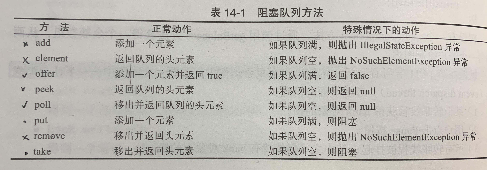
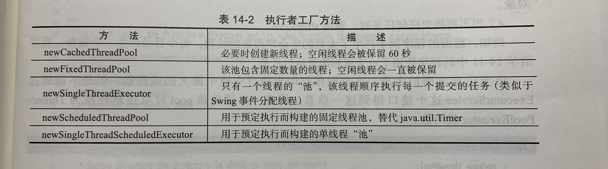

# Core Java(Volume 1_Fundamentals)
    core java notes
## V1_Chapter 14 并发
### 14.1 什么是线程
1.sleep是Thread类的静态方法，用于暂停当前线程的活动，sleep方法可以抛出一个InterruptedException异常。   
2.由于Runnable接口是一个函数式接口，可以用lambda表达式建立一个实例：
```
Runnable r = () -> {task code};
```
3.直接调用run()方法，只会执行同一个线程中的任务，而不会启动新线程，应该调用Thread.start()方法，这个方法将创建一个
执行run()方法的新线程。
### 14.2 中断线程
1.interrupt方法可以用来请求终止线程，当对一个线程调用interrupt方法时，线程的中断状态将被置位，这是每一个线程都具有
boolean标志，每个线程都应该不时地检查这个标志，以判断线程是否被中断，但是如果线程被阻塞，就无法检测中断状态，这是产生
InterruptedException异常的地方，当在一个被阻塞的线程（调用sleep或wait）上调用interrupt方法时，阻塞调用将会被
Interrupted Exception异常中断。
### 14.3 线程状态
1.要确定一个线程的当前状态，可调用getState方法。   
2.线程可以有6种状态：   
1）New（新创建）：当调用new创建一个新线程时，该线程还没有开始运行，这意味着它的状态是new，当一个线程处于新创建状态
时，程序还没有开始运行线程中的代码，在线程运行之前还有一些基础工作要做。   
2）Runnable（可运行）：一旦调用start方法，线程处于runnable状态，一个可运行的线程可能正在运行也可能没有运行，这取
决于操作系统给线程提供运行的时间。（Java的规范说明并没有将它作为一个单独状态，一个正在运行中的线程仍然处于可运行状态。
运行中的线程被中断，目的是为了给其他线程获得运行机会，线程调度的细节依赖于操作系统提供的服务，抢占式调度系统给每一个
可运行线程一个时间片来执行任务，当时间片用完，操作系统会剥夺该线程的运行权，并给另一个线程运行机会，当选择下一个线程
时，操作系统考虑线程的优先级。现在所有的桌面以及服务器操作系统都使用抢占式调度，但是，想手机这样的小型设备可能使用协
作式调度。在具有多个处理器的机器上，每一个处理器运行一个线程，可以有多个线程并行运行，当然，如果线程的数目多于处理器
的数目，调度器依然采用时间片机制，在任何给定时刻，一个可运行的线程可能正在运行也可能没有运行。   
3）Blocked（被阻塞）：当线程处于被阻塞或等待状态时，它暂时不活动，它不运行任何代码且消耗最少的资源，直到线程调度器重
新激活它，细节取决于它是怎样达到非活动状态的。   
a.当一个线程试图获取一个内部对象锁，而该锁被其他线程持有时，该线程进入阻塞状态，当所有其他线程释放该锁，并且线程调度
器允许本线程持有它的时候，该线程将变成非阻塞状态。   
b.当线程等待另一个线程通知调度器一个条件时，它自己进入等待状态，调用wait(),join(),Lock,Condition时，就会出现这种
情况。   
4）Waiting（等待）：    
5）Timed waiting（计时等待）：Thread.sleep, Object.wait, Thread.join, Lock.tryLock, Condition.await。   
6）Terminated（被终止）：线程因如下原因之一而被终止：1）因为run方法正常退出而自然死亡；2）因为没有一个捕获的异常中
止了run方法而意外死亡。（stop已经过时，不要使用）
### 14.4 线程属性
1.在Java程序设计语言中，每一个线程都有一个优先级，默认情况下，一个线程继承它的父线程的优先级，可以用setPriority方法
提高或降低任何一个线程的优先级，可以将优先级设置在MIN_PRIORITY(在Thread类中定义为1)与MAX_PRIORITY(定义为10)之间
的任何值，NORM_PRIORITY被定义为5。   
2.不要将程序构建为功能的正确性依赖于优先级。   
3.setDaemon(true)守护线程，它的唯一用途是为其他线程提供服务，当只剩下守护线程时，虚拟机就退出了，由于如果只剩下守
护线程就没有必要继续运行程序了，守护线程应该永远不去访问固有资源，如文件，数据库，因为它会在任何时刻甚至一个操作的中
间发生中断。   
4.线程的run方法不能抛出任何受查异常，但是，非受查异常会导致线程中止，在这种情况下，线程就死亡了，可以用setUncaughtExceptionHandler
方法为任何线程安装一个处理器，也可以用Thread类的静态方法setDefaultUncaughtExceptionHandler为所有线程安装一个默
认的处理器。   
5.线程组是一个可以统一管理的线程集合，默认情况下，创建的所有线程属于相同的线程组，但是，也可能建立其他的组，现在引入
了更好的特性用于线程集合的操作，所以建议不要在自己的程序中使用线程组。   
### 14.5 同步
1.把解锁操作放在finally子句之内是至关重要的，如果在临界区的代码抛出异常，锁必须被释放，否则，其他线程将永远阻塞。   
2.每一个Bank对象有自己的ReentrantLock对象，如果两个线程试图访问同一个Bank对象，那么锁以串行方式提供服务，但是，如
果两个线程访问不同的Bank对象，每一个线程得到不同的锁对象，两个线程都不会发生阻塞。   
3.锁是可重入的，因为如果线程可以重复的获得已经持有的锁，锁保持一个持有计数来跟踪对lock方法的嵌套调用，线程在每一次调
用lock都要调用unlock来释放锁，由于这一特性，被一个锁保护的代码可以调用另一个使用相同的锁的方法。   
4.锁和条件的关键之处：1）锁用来保护代码片段，任何时刻只能有一个线程执行被保护的代码；2）锁可以管理试图进入被保护代码
段的线程；3）锁可以拥有一个或者多个相关的条件对象；4）每个条件对象管理那些已经进入被保护的代码段但还不能运行的程序。   
5.volatile关键字为实例域的同步访问提供了一种免锁机制，如果声明一个域为volatile，那么编译器和虚拟机就知道该域是可能
被另一个线程并发更新的。volatile变量不能提供原子性。   
6.java.util.concurrent.atomic包中有很多类使用了很高效的机器级指令（而不是使用锁）来保证其他操作的原子性，例如，
AtomaicInteger提供了方法incrementAndGet和decrementAndGet，它们分别以原子的方式将一个整数自增或自减。   
7.所有线程都被阻塞，这样的状态成为死锁。   
### 14.6 阻塞队列
1.生产者线程向队列插入元素，消费者线程则取出它们，使用队列，可以安全地从一个线程向另一个线程传递数据，当试图向队列添
加元素而队列已满，或是想从队列移出元素而队列为空的时候会导致阻塞队列。 
2.阻塞队列方法
 
poll和peek方法返回空来指示失败，因此，向这些队列中插入null值是非法的。   
### 14.7 线程安全的集合
1.ArrayList和HashMap不是线程安全的，集合库中提供了不同的机制，热河集合类都可以通过使用同步包装变成线程安全的：
```
List<E> synchArrayList = Collections.synchronizedList(new ArrayList<E>());
Map<K,V> synchHashMap = Collections.synchronizedMap(new HashMap<K,V>());
```
最好使用java.util.concurrent包中的集合。
### 14.8 Callable与Future
### 14.9 执行器
1.创建一个新的线程是有一定代价的，因为涉及与操作系统交互，如果在程序中创建大量的生命期很短的线程，应该使用线程池，一
个线程池中包含许多准备运行的空闲线程，将Runnable对象交给线程池，就会有一个线程调用run方法，当run方法退出时，线程不
会死亡，而是在池中准备为下一个请求提供服务。使用线程池的另一个理由是减少并发线程的数目，创建大量线程会大大降低性能甚
至使虚拟机崩溃。执行器（Executor）：
 
2.使用线程池时应该做的事：1）调用Executors类中的静态方法newCachedThreadPool或newFixedThreadPool；2）调用submit
提交Runnable或Callable对象；3）如果想要取消一个任务，或者如果提交Callable对象，那就要保存好返回的Future对象；4）
当不再提交任何任务时，调用shutdown。   
### 14.10 同步器
### 14.11 线程与Swing
